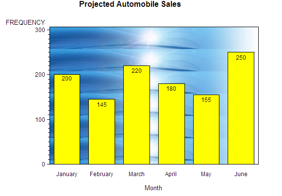

# Running a SAS Program
* Programs can be submitted by clicking the Run icon or pressing the F3 key.

* To run a subset of a program, highlight the desired statements first.
 
* If you are using SAS Studio, click the Run icon or press F3.
* If you are using SAS Enterprise Guide, click the arrow next to Run and click Run Selection or press F3.

* A program can create a log, results, and output data.

* Submitting a program that has run previously in Enterprise Guide or SAS Studio replaces the log, output data, and results.

* Submitting a program that has run previously in the SAS windowing environment appends the log and results.

# Understanding SAS Syntax

* SAS programs consist of DATA and PROC steps, and each step consists of statements.

 

* Global statements are outside steps.


* All statements end with a semicolon.
* Spacing doesn’t matter in a SAS program.
* Unquoted values can be lowercase, upper case, or mixed case.
* Consistent program spacing is a good practice to make programs legible.
* Use the following automatic spacing features:

SAS Studio: Click the Format Code icon.

Enterprise Guide: Select Edit -> Format Code or press Ctrl+I.

* Comments can be added to prevent text in the program from executing.
* Some common syntax errors are unmatched quotes, missing semicolons, misspelled keywords, and invalid options.
* Syntax errors might result in a warning or error in the log.
* Refer to the log to help diagnose and resolve syntax errors.

  # Importing Data
* The DBMS option identifies the file type. The CSV value is included with Base SAS.
* The OUT= option provides the library and name of the SAS output table.
* The REPLACE option is necessary to overwrite the SAS output table if it exists.
* SAS assumes that column names are in the first line of the text file and data begins on the second line.
* Date values are automatically converted to numeric SAS date values and formatted for easy interpretation.
* The GUESSINGROWS= option can be used to increase the number of rows SAS scans to determine each
   
   column’s type and length from the default 20 rows up to 32,767.

  


## Displaying an Image in Graph Frame

Procedure action statements that support the `IFRAME=` option allow frames, which are the backplanes behind the graphs. The backplane is the area within the graph axes. To place an image on the backplane of a graph, specify the `IFRAME=` option in the procedure action statement that generates the graph. On the `IFRAME=` option, specify either the path to the image file in quotation marks or a fileref that has been defined to point to the image file:


**Note**: If you specify the `NOFRAME` option in the procedure action statement or if you specify `STYLE=0` in the `AXIS` statement, the `IFRAME=` option is ignored.

For example, the following program creates a vertical bar chart and adds an image to the graph frame:

```sas
goptions reset=all htitle=1.25 colors=(yellow cxde7d6f);
title "Projected Automobile Sales";

data sales;
    input Month Amount;
    informat month monyy.;
    datalines;
jan08 200
feb08 145
mar08 220
apr08 180
may08 155
jun08 250
;
run;

proc sort data=sales;
    by month;
run;

proc gchart data=sales;
    format month monname8.;
    vbar month / discrete freq=amount inside=freq
                 coutline=black 
                 iframe="external-image-file"; /* Path to your image file */
run;
quit;

goptions reset=all htitle=1.25 colors=(yellow cxde7d6f);
title "Projected Automobile Sales";

data sales;
    input Month Amount;
    informat month monyy.;
    datalines;
jan08 200
feb08 145
mar08 220
apr08 180
may08 155
jun08 250
;
run;

proc sort data=sales;
    by month;
run;

proc gchart data=sales;
    format month monname8.;
    vbar month / discrete freq=amount inside=freq
                 coutline=black 
                 iframe="external-image-file"; /* Path to your image file */
run;
quit;

Because the default value for the GPLOT procedure’s IMAGESTYLE= option is TILE, the image is copied as many times as needed to fill the frame area.



You can specify IMAGESTYLE=FIT in the GOPTIONS statement to stretch the image so that a single image fits within the entire frame area.


